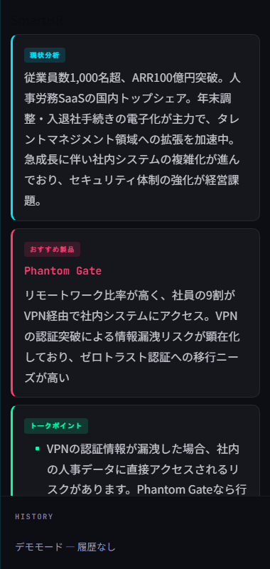
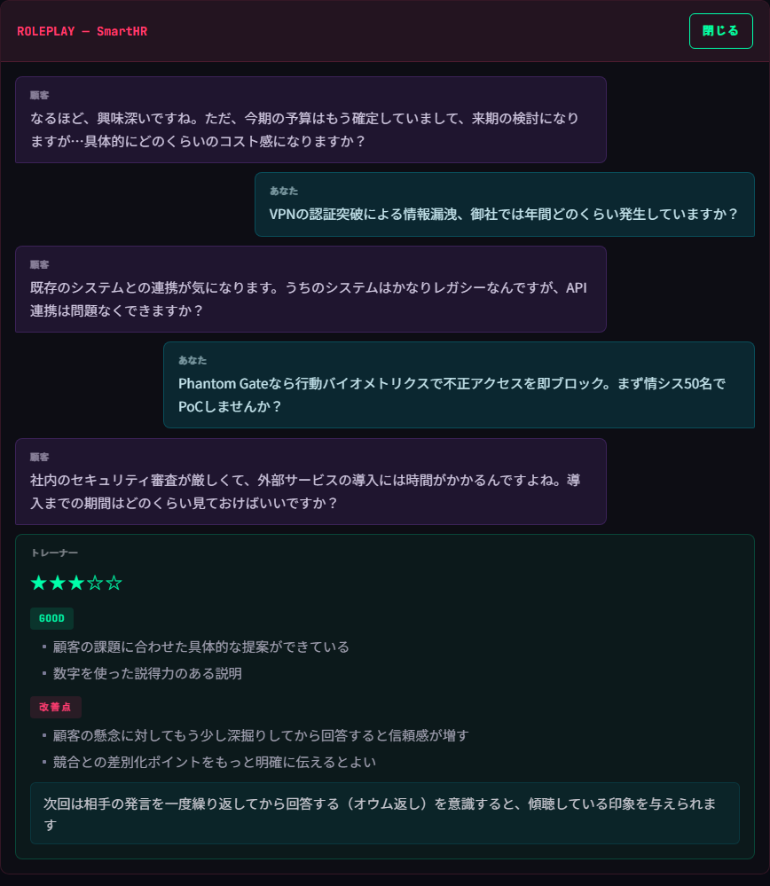
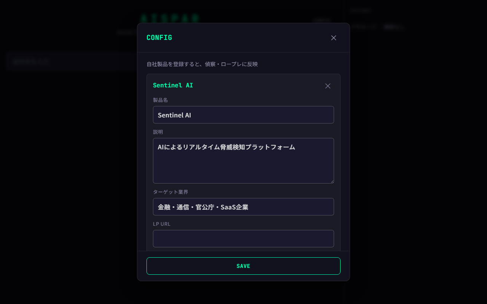

<h1 align="center">AISPAR</h1>
<p align="center">
  会社名を入れろ。偵察もロープレも全部やる
  <br />
  <br />
  <a href="https://shumatsumonobu.github.io/aispar/"><strong>デモを試す →</strong></a>
</p>

<br />

<video src="screenshots/demo.mp4" autoplay loop muted playsinline width="100%"></video>

<br />

## 何ができる？

```
会社名を入力 → AIが偵察・作戦立案
             → そのままAI相手にロープレ
             → 終了後にスコア付きフィードバック
```

<br />

## 偵察



AIがGoogle検索で相手企業を偵察。現状分析・おすすめ製品・トークポイント・想定Q&Aを自動生成

<br />

## ロープレ



AIが相手企業の担当者になりきって応戦

- 予算・工数・セキュリティ・実績、あらゆる角度から切り返し
- 簡単に「いいですね」とは言わない。1回で納得もしない
- 終了後、5段階スコア + Good / 改善点 / 次のコツ

<br />

## 製品設定



自社製品を登録すると、偵察・ロープレに反映

<br />

## 自分のデータで使う

デモはサンプルデータで動作。自社の製品・APIキーで使う場合:

### 1. APIキーの準備

| API | 用途 | 取得先 |
|-----|------|--------|
| Google Custom Search | 会社情報の検索 | [Programmable Search Engine](https://programmablesearchengine.google.com/) |
| Gemini API **または** Vertex AI | AI分析・ロープレ | [AI Studio](https://aistudio.google.com/apikey) または [Cloud Console](https://console.cloud.google.com/) |

### 2. インストール

```bash
git clone https://github.com/shumatsumonobu/aispar.git
cd aispar
npm install
cp .env.example .env
```

`.env` を編集（認証はどちらか一方でOK）

```bash
# 方法1: Gemini APIキー（手軽）
GEMINI_API_KEY=your-gemini-api-key

# 方法2: サービスアカウント（Vertex AI経由）
# GOOGLE_APPLICATION_CREDENTIALS=/path/to/service-account.json
# GCP_PROJECT_ID=your-project-id

# Google Custom Search
GOOGLE_CSE_API_KEY=your-cse-api-key
GOOGLE_CSE_ID=your-cse-id
```

### 3. 起動

```bash
npm run dev
# http://localhost:3000
```

起動後、CONFIGから自社製品を登録すると偵察・ロープレに反映

<br />

## 技術スタック

<table>
  <tr>
    <td align="center"><strong>Backend</strong></td>
    <td>Node.js / Express</td>
  </tr>
  <tr>
    <td align="center"><strong>AI</strong></td>
    <td>Gemini 2.5 Flash</td>
  </tr>
  <tr>
    <td align="center"><strong>Search</strong></td>
    <td>Google Custom Search API</td>
  </tr>
  <tr>
    <td align="center"><strong>Frontend</strong></td>
    <td>Tailwind CSS / Vanilla JS</td>
  </tr>
</table>

<br />

## Author

**shumatsumonobu** — [GitHub](https://github.com/shumatsumonobu) / [X](https://x.com/shumatsumonobu) / [Facebook](https://www.facebook.com/takuya.motoshima.7)

## License

[MIT](LICENSE)
